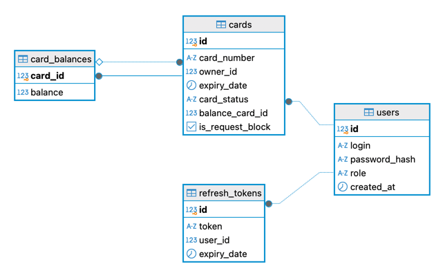

# Проект: Система управления банковскими картами

## Описание

Проект представляет собой сервис для управления банковскими картами, с возможностью создания, блокировки, активации, просмотра баланса и переводов между своими картами. Реализована полноценная аутентификация и авторизация с JWT, доступ по ролям (ADMIN, USER) и защита конфиденциальных данных (номера карт шифруются и маскируются).

## Основные возможности

**Для пользователя (USER):**
- Просмотр своих карт с фильтрацией и пагинацией
- Просмотр баланса
- Переводы между своими картами
- Запрос на блокировку карты

**Для администратора (ADMIN):**
- Создание новой карты пользователю
- Блокировка, активация и удаление карт
- Просмотр всех карт с фильтрацией и пагинацией

**Системные возможности:**
- Автоматическая деактивация просроченных карт
- Шифрование номеров карт (Jasypt)
- Маскирование номера при отображении
- Аутентификация и авторизация (JWT access + refresh в HttpOnly cookie)
- Глобальная обработка ошибок (`@ControllerAdvice`)
- Документация Swagger / OpenAPI
- Docker Compose для развёртывания
- Unit-тесты сервисов и контроллеров

## Технологии

| Компонент | Технология                                                       |
|-----------|------------------------------------------------------------------|
| Backend | Java 17, Spring Boot 3.5.6 (Web, Security, Data JPA, Validation) |
| БД | PostgreSQL                                                       |
| Миграции | Liquibase                                                        |
| Аутентификация | JWT (Access/Refresh)                                             |
| Контейнеризация | Docker Compose                                                   |
| Документация | Swagger / OpenAPI                                                |
| Тесты | JUnit 5 + Mockito                                                |
| Прочее | Lombok, Maven                                                    |

## Структура базы данных



Миграции находятся в src/main/resources/db/changelog и выполняются через Liquibase.

## Запуск

1. Склонировать репозиторий:

   ```bash
   git clone https://github.com/asafetida987/bank-rest.git
   cd bank-rest
   ```
2. Создать .env файл (пример):
   ```
   POSTGRES_USER=postgres
   POSTGRES_PASSWORD=postgres
   POSTGRES_DB=bank
   SPRING_DATASOURCE_URL=jdbc:postgresql://db:5432/bank-api
   JWT_ACCESS_SECRET_KEY=ACCESSTOKEN
   JWT_REFRESH_SECRET_KEY=REFRESHTOKEN
   ENCRYPTION_SECRET=ENCRYPTIONSECRET
   LOG_LEVEL=INFO
   ```

3. Запустить с помощью Docker Compose:

   ```bash
   docker compose up -d
   ```
4. Приложение будет доступно по адресу:

    * Backend: `http://localhost:8080`
    * Swagger UI: `http://localhost:8080/swagger-ui/index.html`


